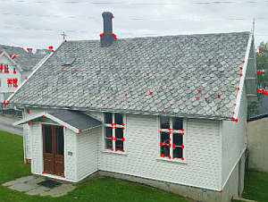

# Image Analysis

The solutions of coding tasks in this folder are upon request to [Yu Feng](mailto:y.feng@tum.de) (Chair of Cartography and Visual Analytics, TUM)

### Assignment 3 - Morphology and image thresholding

includes the exercises on basic operations using OpenCV libraray.
- Morphology
- Image thresholding
- Example of simple road extraction

### Assignment 4 - Extraction of regions and edges

includes the exercises on basic segmentation operations using OpenCV and scikit-image libraray.
- Region Growing
- Watershed Transformation
- Mean Shift Segmentation
- SLIC superpixels algorithm
- Douglas Peucker Algorithm
- Hough transformation

### Assignment 6 - Harris Corner Detection

includes the exercises on building the Harris Corner detector.
- Sobel Operator
- Structure Matrix
- Corner response function

