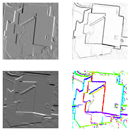

# Image Processing

The solutions of coding tasks in this folder are upon request to [Yu Feng](mailto:y.feng@tum.de) (Chair of Cartography and Visual Analytics, TUM)

### Assignment 1 - Basic Image Processing

includes the exercises on basic image operations.
- Load and Show
- Spilt the channel of color image
- Invert the color
- Mean value and variance value
- Histogram

### Assignment 2 - Image filters

includes the exercises on basic image filtering operations using OpenCV libraray.
- Basic convolution operation
- Image smoothing with Box Filter, Binomial Filter and Median Filter
- Image gradient with Sobel Filter
- Laplacian filter

### Assignment 5 - Geometric Transformations of Images

includes the exercises on basic geometric transformation.
- Scaling
- Affine Transformation
- Translation, Rotation
- Arbitrary affine transform
- Perspective Transformation

